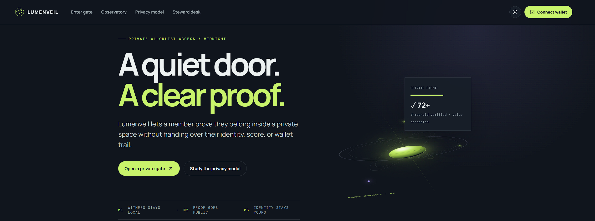
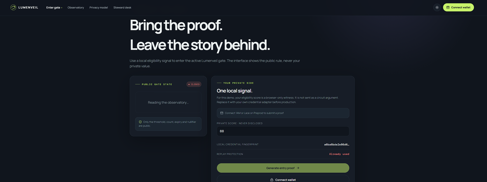
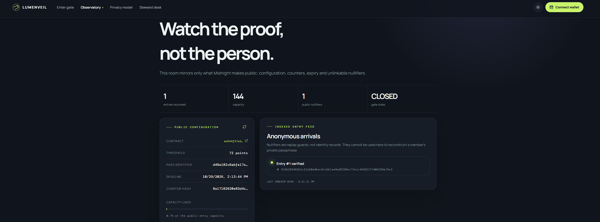
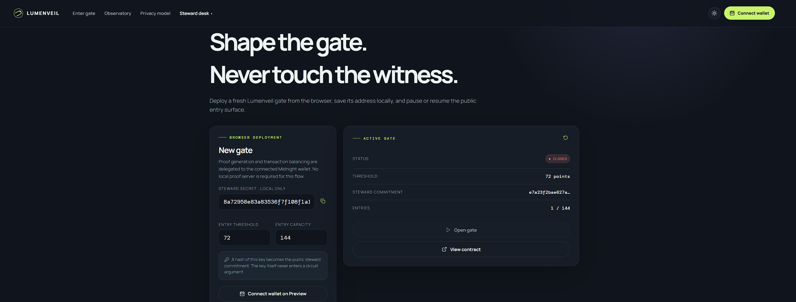
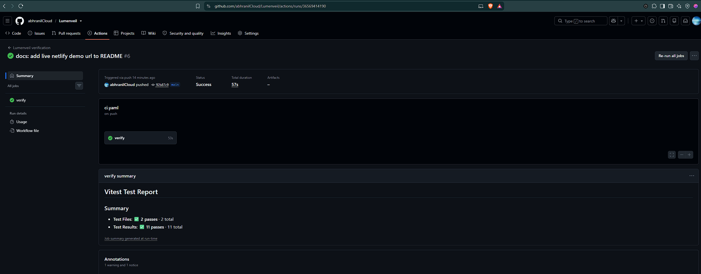
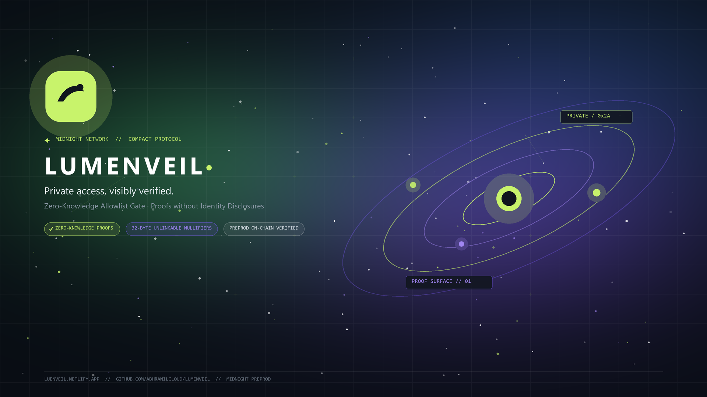

# Lumenveil

[](https://github.com/abhranilCloud/Lumenveil/actions)
[](https://explorer.1am.xyz/contract/mn_addr_preview1dhz0lg68503awm8x98f3l4te3ae74jay2fewfysywu5kd4st5anqj0yg5d?network=preprod)
[](https://luenveil.netlify.app)
[](https://drive.google.com/file/d/1u1SkOne7ej5Yoq1EFRcod6GRpp3C1kvy/view?usp=sharing)
[](https://x.com/LumenveilZK)

### Private access, visibly verified.

Lumenveil is a privacy-first allowlist gate for Midnight Network. A member proves that a private eligibility signal clears a curator's public threshold, while the signal, passphrase, and identity stay inside the proving session.



> **Project state:** Contract deployed to Preprod. Deployed contract address, live web application, video demonstration, and official X (Twitter) channel are linked below.

---

## 🚀 Live Demo & Deployed Contract (Preprod)

- 🌐 **Live Web Application:** [https://luenveil.netlify.app](https://luenveil.netlify.app)
- 🎥 **Demo Video Walkthrough:** [Watch 1-Minute Demo Video](https://drive.google.com/file/d/1u1SkOne7ej5Yoq1EFRcod6GRpp3C1kvy/view?usp=sharing)
- 🐦 **Official X Profile:** [@LumenveilZK](https://x.com/LumenveilZK)
- 📢 **Launch Announcement Post:** [View on X](https://x.com/LumenveilZK/status/2104920507305050423?s=20)
- 🧵 **Product Thread / Overview:** [View on X](https://x.com/LumenveilZK/status/2104920455258001643?s=20)
- 📜 **Contract Address:** [`mn_addr_preview1dhz0lg68503awm8x98f3l4te3ae74jay2fewfysywu5kd4st5anqj0yg5d`](https://explorer.1am.xyz/contract/mn_addr_preview1dhz0lg68503awm8x98f3l4te3ae74jay2fewfysywu5kd4st5anqj0yg5d?network=preprod)
- 🔍 **Deployment Transaction:** [`b2ed3febe5b34c22b621dde4d41b30d47d73b9c91ddb5e05e160b047284e560e`](https://explorer.1am.xyz/tx/b2ed3febe5b34c22b621dde4d41b30d47d73b9c91ddb5e05e160b047284e560e?network=preprod)
- 🧭 **1AM Contract Explorer:** [View on 1AM Explorer](https://explorer.1am.xyz/contract/mn_addr_preview1dhz0lg68503awm8x98f3l4te3ae74jay2fewfysywu5kd4st5anqj0yg5d?network=preprod)
- 🛡️ **Deployment Status:** Verified on-chain on Midnight Preprod

---

## 📸 Interface & Evidence Gallery

### Screenshot 1: Hero Overview & Application Interface
High-contrast observatory interface featuring dark/light aesthetic, constellation hero, live wallet indicators, and quick navigation.


### Screenshot 2: Member Gate — Zero-Knowledge Proof Generation
A member proves their private eligibility score meets the gate threshold without revealing the score, passphrase, or identity on-chain.


### Screenshot 3: Public Observatory — On-Chain State Inspection
Real-time inspection of public gate parameters (threshold, deadline, entry limit) and anonymous nullifier logs without exposing private credentials.


### Screenshot 4: Steward Desk — Wallet Deployment & Access Controls
Curator portal enabling browser-based contract deployment via 1AM / Midnight browser wallet, threshold adjustments, and gate lifecycle management.


### Screenshot 5: CI/CD Pipeline & Automated Verification
Continuous integration pipeline running automated Compact contract tests, deterministic witness proofs, and production frontend builds.


---

## 🎨 Brand Assets & X (Twitter) Banner

- **Official Master Logo (1024×1024 PNG):** [`assets/logo.png`](assets/logo.png)
- **Official X Profile Banner (1920×1080, 16:9 ratio):** [`assets/banner.png`](assets/banner.png)



---

## Product idea

Private communities, research rooms, and event drops should be able to verify membership without turning a guest list into a public identity map. Lumenveil gives a curator a verifiable gate: publish the rule, let a member prove they meet it, and record only an anonymous one-time result. The same pattern can power confidential credentials, private allowlists, and invitation-only access without forcing users to disclose their wallet address or the underlying credential.

## Why Lumenveil is different

- **Private allowlist access:** selected from the Level 3 problem list.
- **A deliberate public surface:** threshold, expiry, capacity, status, counter, and nullifiers only.
- **A real Compact contract:** `prove_entry`, steward-only gate management, domain-separated nullifiers.
- **A browser deployment portal:** connect a Midnight wallet, deploy compiled artifacts, save the address, and open the explorer.
- **A calm observatory:** users can inspect the public state without seeing private member data.
- **Day/night UI:** semantic tokens, keyboard-visible focus, reduced-motion-safe CSS, and a responsive layout.

## Architecture

```text
contracts/lumenveil.compact
        │ compactc 0.31.x
        ▼
contracts/managed/lumenveil/       generated bindings + zkir + prover/verifier keys
        │ npm run copy:managed
        ├── frontend/src/managed/contract/
        └── frontend/public/managed/

React + Vite
  ├── Gate          member proof flow
  ├── Observatory   public indexed state
  ├── Steward desk  browser deployment + gate controls
  └── Privacy model public/private boundary

Midnight browser wallet
  ├── DApp Connector API discovery
  ├── wallet-provided network configuration
  ├── proving and balancing
  └── transaction approval + submission
```

## Privacy model

### Public on-chain ledger

The following values are intentionally exported in `contracts/lumenveil.compact`:

- `entry_threshold` — the rule being proved against
- `access_pass_id` — the current gate domain
- `entry_deadline` and `gate_open` — lifecycle controls
- `curator_id` and `steward` — public commitments
- `total_entries` and `entry_limit` — aggregate capacity
- `used_nullifiers` / `entry_log` — replay protection and anonymous entry records

### Private client witness

The following values are supplied by the browser witness callbacks and do not become circuit arguments:

- `get_eligibility_score()` — the private value compared with the threshold
- `get_passphrase()` — the secret used to derive a gate-scoped nullifier
- `steward_secret()` — the private key used for steward authorization

`disclose()` is used only when a value is intentionally moved into public ledger state. A proof proves that the private score met the rule; it does not disclose the score. Observers can see that `prove_entry` occurred, when it occurred, that the gate accepted it, and the resulting nullifier. They cannot recover the score, passphrase, wallet address, or source credential from the proof.

## Getting started

### Prerequisites

- Node.js 22+
- npm 10+ or Yarn 1.22+
- Docker Desktop for the local network
- Compact compiler 0.31.x (`compactc`)
- A Midnight-compatible browser wallet such as 1AM or Lace for Preview/Preprod deployment

Verify the toolchain:

```bash
node --version
compactc --version
npm --version
```

### Install and compile

```bash
npm install
npm run compile
```

`npm run compile` compiles the Compact source and synchronizes the generated managed bindings and ZK assets into the frontend. Do not hand-edit `contracts/managed/lumenveil`.

### Run the contract test suite

```bash
npm test
```

The suite covers initial state, eligible and ineligible witnesses, one-time nullifiers, steward authorization, gate lifecycle, and domain separation. Local network integration is intentionally separate from the deterministic runtime tests.

### Start the local network

```bash
npm run env:up
npm run compile
npm run test:local
npm run env:down
```

For a full local transaction flow, wait for the indexer and DUST to be ready before submitting transactions. DUST is Midnight's transaction resource and is not the same thing as a private member credential.

### Run the frontend

```bash
npm run build
npm run dev -w lumenveil-frontend
```

Open the Vite URL shown in the terminal. The browser requests proving assets from `/managed`.

### Preview / Preprod environment

Copy `.env.preprod.example` to a private `.env.preprod` and provide either a seed or mnemonic. Never commit wallet secrets. The frontend defaults to the Preprod indexer and accepts a deployed address through either:

1. the Steward desk deployment flow, which saves `DEPLOYED_CONTRACT_ADDRESS` to `localStorage`; or
2. `VITE_CONTRACT_ADDRESS` at build time.

## Browser deployment flow

1. Open **Steward desk**.
2. Connect a wallet on Preview for deployment, or use Preprod when that is your target.
3. Keep or replace the locally generated 32-byte steward secret.
4. Set a threshold and capacity.
5. Approve the transaction in the wallet.
6. The new contract address is saved to `localStorage` and rendered with an explorer link.
7. Open **Gate** to prove entry or **Observatory** to inspect indexed public state.

The deployer uses `CompiledContract.make`, `createUnprovenDeployTx`, `sampleSigningKey`, and `submitTxAsync`. Constructor arguments match the generated `initialState` signature exactly:

```text
(threshold, pass, deadline, curator, steward_hash, limit)
```

## Level 1–4 cross-check

| Level | Implementation in this project | Status & Evidence |
|---|---|---|
| 1 — New Moon | Compact source, generated `managed/` directory, deterministic tests, setup docs, public/private explanation, **Preprod deployed contract** | ✅ Verified on Preprod, 70+ commits, docs ready |
| 2 — Waxing Crescent | Wallet connect/disconnect, browser proving session, real `prove_entry` call, observable anonymous entry, **verified on-chain Preprod contract**, **live demo URL**, **demo video** | ✅ Live on [luenveil.netlify.app](https://luenveil.netlify.app) & [Demo Video](https://drive.google.com/file/d/1u1SkOne7ej5Yoq1EFRcod6GRpp3C1kvy/view?usp=sharing) |
| 3 — First Quarter | Private allowlist product proposal, 11+ automated tests, CI workflow compiling/testing/building, privacy observatory, **full functionality demo video** | ✅ Passing CI workflow ([`assets/cicd.png`](assets/cicd.png)), full test suite, demo video |
| 4 — Waxing Gibbous | Steward deployment portal, public/private technical docs, release build workflow, product-ready UI, day/night theme, **live Netlify deployment**, **public product (X) profile** | ✅ Complete UI screenshots gallery, live production build, [@LumenveilZK](https://x.com/LumenveilZK) active on X |

## Evidence checklist

- [x] Deployed contract address and transaction on Preprod (`mn_addr_preview1dhz0lg68503awm8x98f3l4te3ae74jay2fewfysywu5kd4st5anqj0yg5d`)
- [x] Live Preview/Preprod demo URL: [https://luenveil.netlify.app](https://luenveil.netlify.app)
- [x] One-minute wallet connect → proof → confirmation video: [Watch Demo Video](https://drive.google.com/file/d/1u1SkOne7ej5Yoq1EFRcod6GRpp3C1kvy/view?usp=sharing)
- [x] Official X (Twitter) profile & product announcements: [@LumenveilZK](https://x.com/LumenveilZK) ([Launch Post](https://x.com/LumenveilZK/status/2104920507305050423?s=20) · [Thread](https://x.com/LumenveilZK/status/2104920455258001643?s=20))
- [x] Official 16:9 X profile banner and master logo ([`assets/banner.png`](assets/banner.png) & [`assets/logo.png`](assets/logo.png))
- [x] Screenshot of deployed contract address and Steward desk ([`assets/4.png`](assets/4.png))
- [x] Screenshot of Member Gate ZK proving flow ([`assets/2.png`](assets/2.png))
- [x] Screenshot of Public State Observatory ([`assets/3.png`](assets/3.png))
- [x] CI badge and passing GitHub Actions run ([`assets/cicd.png`](assets/cicd.png))
- [x] 70+ meaningful commits across git history (exceeds all Level 1–4 commit count requirements)

## Design system

Lumenveil uses a quiet observatory direction rather than a generic crypto dashboard: Manrope for editorial hierarchy, DM Mono for cryptographic metadata, a lime signal accent, restrained violet public-state markers, a constellation/orbit hero, and near-solid surfaces for readable contrast. The day/night toggle uses `data-theme` semantic tokens. Decorative motion is minimal and the experience still communicates proving state as text.

The interface was shaped using the UI UX Pro Max workflow and accessibility guidance from skills.sh resources, with Midnight wallet/session patterns from the project skill references. The implementation keeps wallet states explicit, keeps transaction-critical actions solid, and avoids logging private witness values.

## Useful commands

```bash
npm run compile       # compile + copy managed artifacts
npm test              # deterministic contract tests
npm run build         # production frontend build
npm run check         # tests + frontend build
npm run env:up        # local node, indexer, proof server
npm run env:down      # stop local services
```

## License

MIT. See [`LICENSE`](LICENSE).
